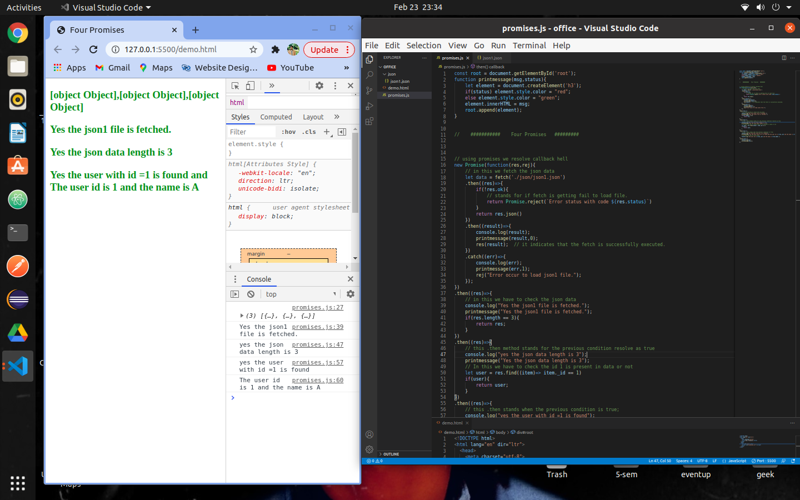
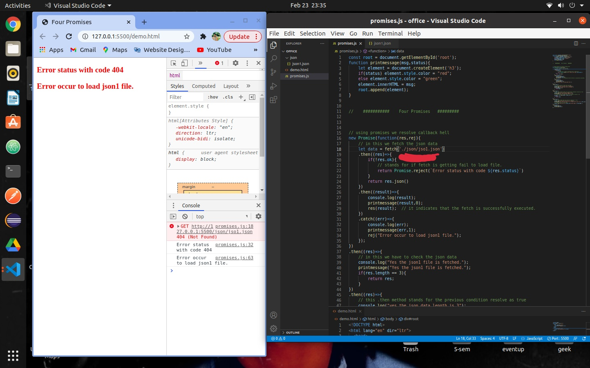

# FourPromises

Here the "Four Promises" Assighnment. In this the 4 chaining promises. 
<h3>Like That </h3>

</img>

I Use this code to display all message to browser (represented as COLOR "Red" for Error And "Green" for Success).
<pre>
          const root = document.getElementById('root');
          function printmessage(msg,status){
              let element = document.createElement('h3');
              if(status) element.style.color = "red";
              else element.style.color = "green";
              element.innerHTML = msg;
              root.append(element);
          }
</pre>

#  In "Promise" I tried to fetch the JSON data that already present in Folder.
Uisng fetch() method that also return a promise that resolves into a Response object.
if fail to fetch file it throw error. otherwise the promise comes in resolve state.  
When the Promise resolve it comes in  " .then()  " where I Perform some Operation,  
Like:  Check Length of Json Data, Find either the ( _id == 1 ) is present or not, Display the Json Data of _id == 1 ;

# Here the ScreenShot When the path is Wrong and the Promises Reject And throw Error.
</img>

